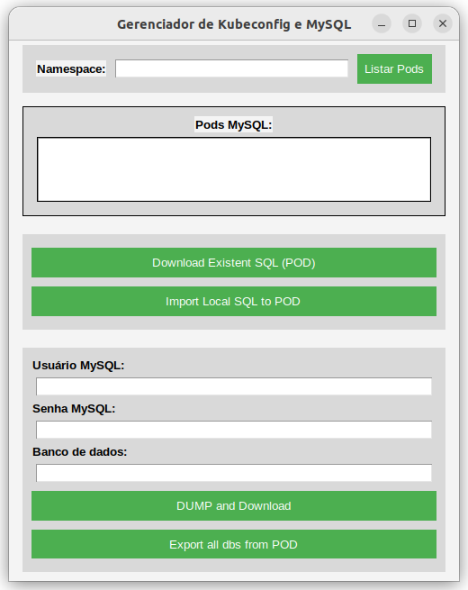

# Gerenciador de Kubeconfig e MySQL com Interface Gráfica

Este projeto é uma aplicação gráfica desenvolvida em **Python** utilizando a biblioteca **Tkinter**.  
Permite gerenciar pods Kubernetes e executar operações em bancos de dados MySQL de forma simples e visual.  

---

## Funcionalidades

- **Listar Pods**  
  Exibe os pods de um namespace selecionado que contenham bancos de dados MySQL.  

- **Criar Dump**  
  Gera um dump do banco de dados selecionado dentro de um pod.  

- **Importar Arquivo SQL**  
  Permite importar um arquivo `.sql` para um banco de dados específico em um pod.  

- **Exportar Dump**  
  Exporta o dump gerado para um arquivo local.  

- **Gerenciar Configurações Kubernetes**  
  Permite importar/exportar arquivos `kubeconfig` e alternar entre contextos do Kubernetes.  

---

## Tecnologias Utilizadas

- **Python 3.x**
- **Tkinter** (Interface Gráfica)
- **kubectl** (Para interação com o Kubernetes)
- **MySQL Client** (Para operações no banco de dados)

---


## Requisitos

Certifique-se de que os seguintes requisitos estão instalados no sistema:  

1. **Python**: [Instale aqui](https://www.python.org/downloads/)  
2. **kubectl**: [Documentação oficial](https://kubernetes.io/docs/tasks/tools/)  
3. **MySQL Client**  

Além disso, instale as dependências do projeto com o comando:  

```bash
pip install -r requirements.txt
